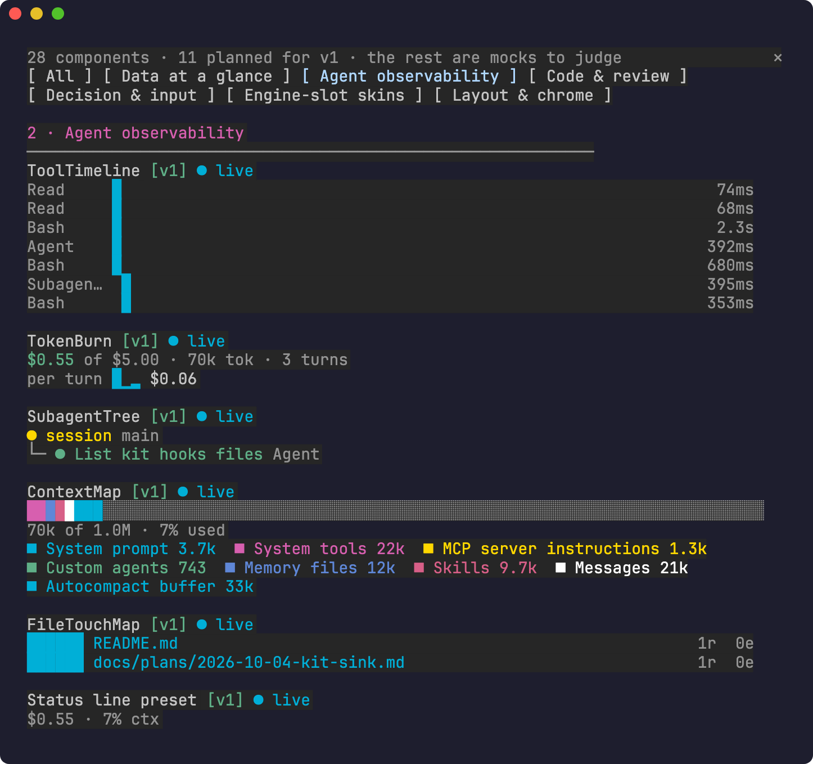
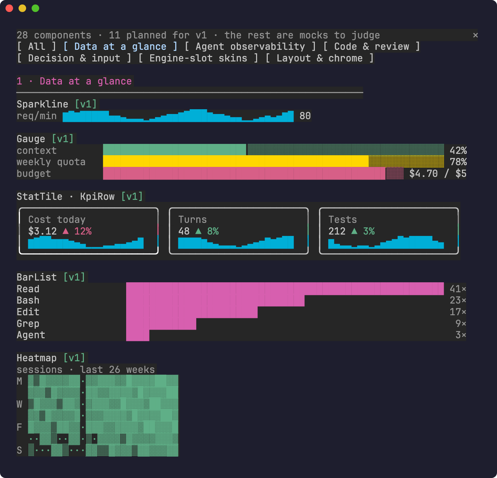
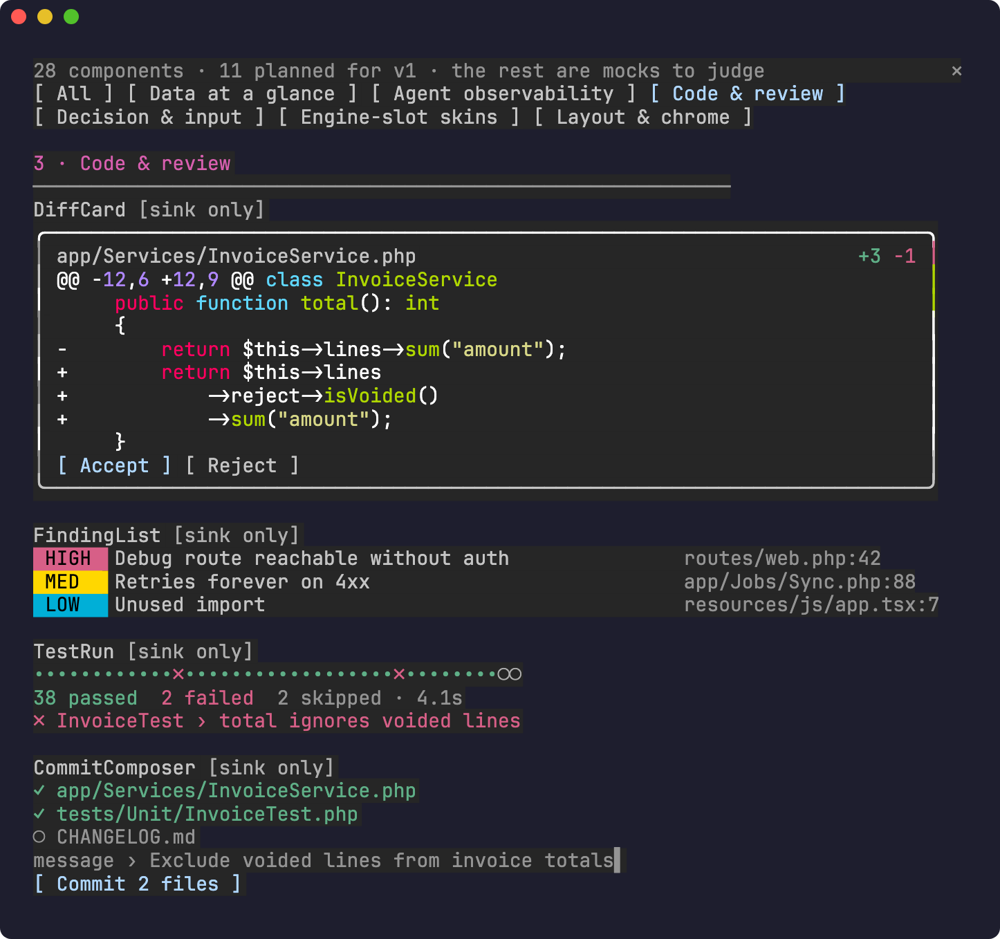
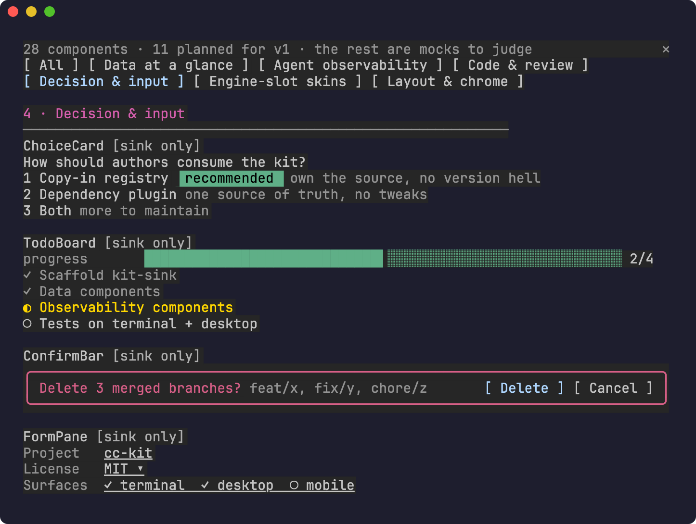
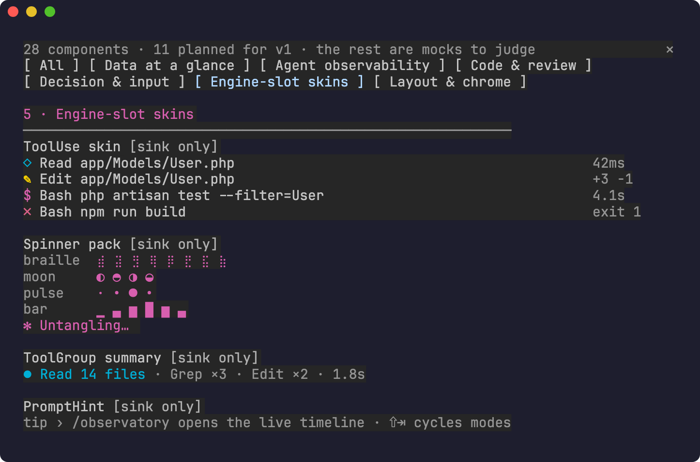
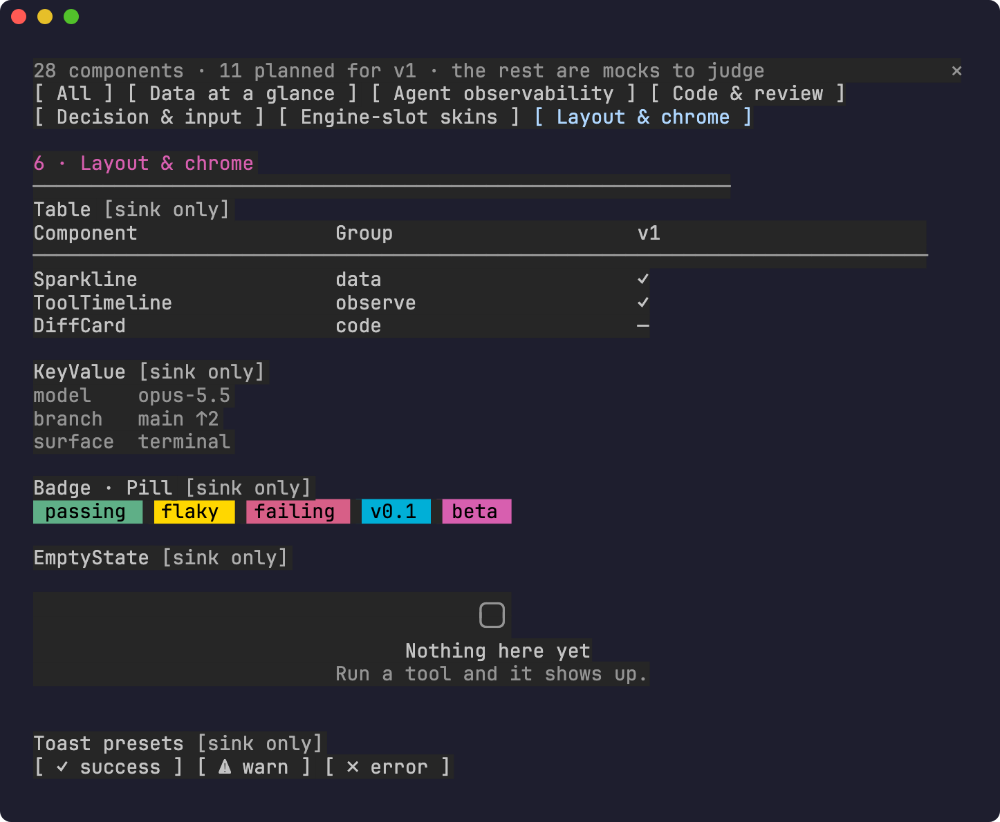

# cc-kit

Visual components for [Claude Code](https://claude.com/claude-code) mods: sparklines, gauges, KPI tiles, heatmaps, and live agent observability (tool timeline, token burn, subagent tree, context map). They draw in the terminal and the desktop app.

> **Early access.** Claude Code's mod API is marked "EARLY ACCESS: this surface may change between releases without notice." cc-kit is tested against **Claude Code 2.1.288**. Expect breakage on newer releases until CI against the latest release lands.

## Status

Phase 0: a **kitchen sink**. Every candidate component is on one pane, so you can see what's possible and judge each one. The registry and `/kit add` come next. See [the design spec](docs/specs/2026-10-04-cc-kit-v1-design.md).

## The demo, screenshot by screenshot

Every screenshot is the kitchen-sink pane (`/kit sink <group>`) captured from a real Claude Code 2.1.288 session. Each component carries a tag:

- `[v1]` means it is planned for the first release.
- `[sink only]` means it is a mock, drawn so it can be judged before anyone builds it properly.
- `● live` means it is drawing your session's real data; `○ mock` means it is showing sample data until there is something real to show.

The header row counts the components. The bracketed buttons are tabs, one per group; each one has a hotkey (0–6).

### 1 · Agent observability (`/kit sink observe`)



These components can only exist as a mod, because only a mod sees the agent's tool calls as they happen. Everything in this shot is **live**.

| Component | What it shows |
|---|---|
| **ToolTimeline** | One row per tool call, laid out on a shared time axis, Gantt-style. Calls that overlap are stacked; the bar length is the duration (shown on the right). A running call is yellow `▸`; a failed one is red. |
| **TokenBurn** | Session spend against a budget ($0.55 of $5.00), tokens and turn count. The sparkline shows the cost of each turn, so a costly turn stands out. The headline turns yellow, then red, as you approach the budget. |
| **SubagentTree** | The live tree of subagents this session spawned: `●` yellow while running, green when done, red when failed. |
| **ContextMap** | What fills the context window, as one stacked bar (system prompt, tools, memory, skills, messages, autocompact buffer) plus a legend. Free space is the grey remainder. Data comes from `$.session.usage`. |
| **FileTouchMap** | The files the agent read (`r`) and edited (`e`) this session, hottest first. Edits weigh more than reads; paths are relative to the repo. |
| **Status line preset** | The same numbers squeezed into one line for `$.ui.status`: `$0.55 · 7% ctx`. |

### 2 · Data at a glance (`/kit sink data`)



General-purpose charts, drawn with text glyphs so they work in any terminal; the desktop app draws the same tree. These are the building blocks the observability components are made of.

| Component | What it shows |
|---|---|
| **Sparkline** | A trend in one line of `▁▂▃▄▅▆▇█`, with an optional label and last value. It resamples to whatever width it is given. |
| **Gauge** | Label, bar, value. Color follows thresholds (green < 70% ≤ yellow < 90% ≤ red), with eighth-cell precision. The right side can be a custom detail (`$4.70 / $5`). |
| **StatTile · KpiRow** | Bordered KPI cards: label, value, a ▲/▼ delta and a trend sparkline. Each delta knows whether "up" is good (Turns) or bad (Cost), and colors itself to match. KpiRow wraps the tiles to fit the pane width. |
| **BarList** | Ranked horizontal bars with right-aligned values, for top tools, top files or top errors. |
| **Heatmap** | A GitHub-style activity grid: 7 rows (days) × N weeks, intensity drawn as `·░▒▓█`. |

### 3 · Code & review (`/kit sink code`) · mocks



| Component | What it shows |
|---|---|
| **DiffCard** | A file header with `+3 −1`, the diff syntax-highlighted by Claude Code's own `Code` element, and Accept / Reject buttons. |
| **FindingList** | Review findings with HIGH / MED / LOW severity badges and a `file:line` for each. |
| **TestRun** | A dot per test (green pass, red `×` fail, grey `○` skipped), a summary line, and the first failure. |
| **CommitComposer** | Staged files (`✓`) versus unstaged ones (`○`), a draft message, and a Commit button. |

### 4 · Decision & input (`/kit sink decide`) · mocks



| Component | What it shows |
|---|---|
| **ChoiceCard** | A question with numbered options, a `recommended` badge and a one-line trade-off for each, as an alternative to a wall of chat text. |
| **TodoBoard** | A progress gauge over a checklist: done `✓` (dimmed), active `◐` (yellow), pending `○`. |
| **ConfirmBar** | A red-bordered confirmation for a destructive action, listing exactly what it will touch, with Delete / Cancel buttons. |
| **FormPane** | Labeled fields: text, a select (`MIT ▾`) and multi-choice. |

### 5 · Engine-slot skins (`/kit sink skins`) · mocks



Claude Code lets a mod redraw its built-in rows. These mocks show what a theme pack could do.

| Component | What it shows |
|---|---|
| **ToolUse skin** | Compact one-line tool rows: an icon per tool, the argument, and the duration or result (`+3 −1`, `exit 1` in red). |
| **Spinner pack** | Alternative spinner frame sets (braille, moon, pulse, bar) and a themed verb (`✻ Untangling…`). |
| **ToolGroup summary** | A burst of calls collapsed into one row: `Read 14 files · Grep ×3 · Edit ×2 · 1.8s`. |
| **PromptHint** | A contextual tip line under the prompt. |

### 6 · Layout & chrome (`/kit sink layout`) · mocks



| Component | What it shows |
|---|---|
| **Table** | Header, rule and rows, with columns sized to the pane width. |
| **KeyValue** | Aligned label/value pairs. |
| **Badge · Pill** | Colored status tags using the kit's semantic tones (ok, warn, bad, info, accent). |
| **EmptyState** | What a component shows before it has any data. |
| **Toast presets** | Buttons that fire `$.ui.toast` in success / warn / error formats. |

## Try the kitchen sink

```sh
claude --plugin-dir /path/to/cc-kit/mods/kit-sink
```

Then, inside Claude Code:

```
/kit sink            # all groups
/kit sink observe    # or: data, code, decide, skins, layout
```

The pane has a tab per group. Components tagged `[v1]` are planned for the first release; `[sink only]` ones are mocks shown to gather feedback. The observability components switch from `○ mock` to `● live` as soon as your session runs a tool.

## Develop

```sh
claude plugin validate mods/kit-sink
claude plugin test mods/kit-sink
```

## License

MIT
